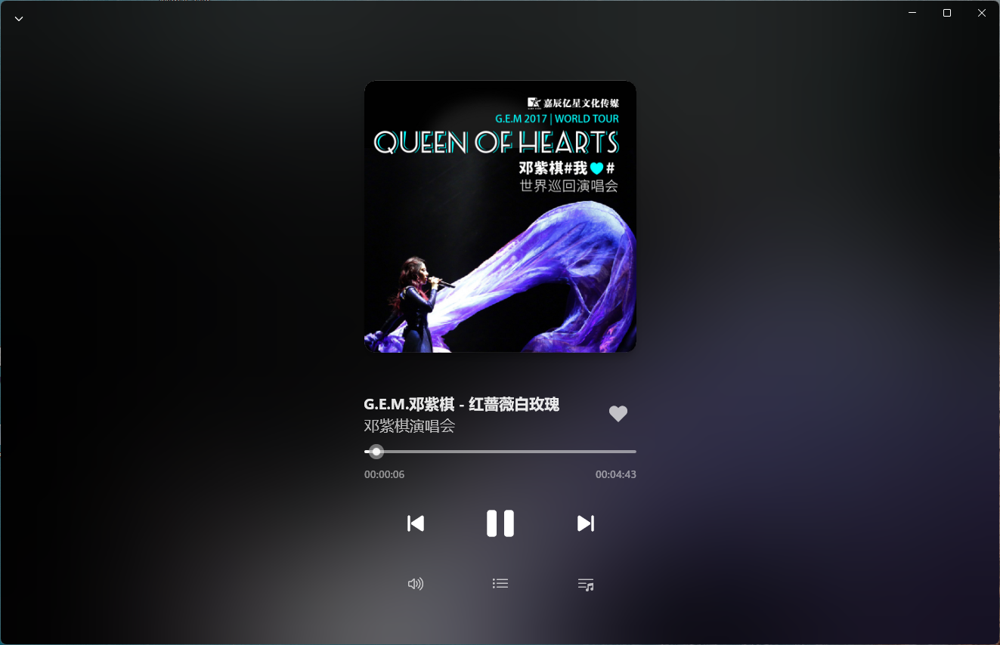

# 纯粹电台  

 

      

---

`纯粹电台` 是一款 [蜻蜓FM](https://www.qingting.fm) 的第三方客户端，使用 UWP 框架开发，是原生的 Windows 应用，支持 Windows 10/11 桌面系统。  

## 安装  

### 配置需求  

- 操作系统: Windows 10 版本 18362.0 或更高版本  
- 体系结构: x86, x64, Arm64  

### 使用安装脚本安装应用包 (Sideload)  

- 打开 [Release](https://github.com/HowieHChen/PureRadio.Uwp/releases) 页面，找到最新版本的安装包并下载。 

- 解压压缩包，右键 `install.ps1` 并选择 `使用 PowerShell 运行` 。  

## 截图

主页  
  

播放页  
  

